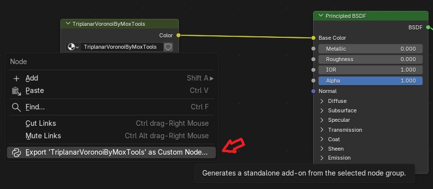
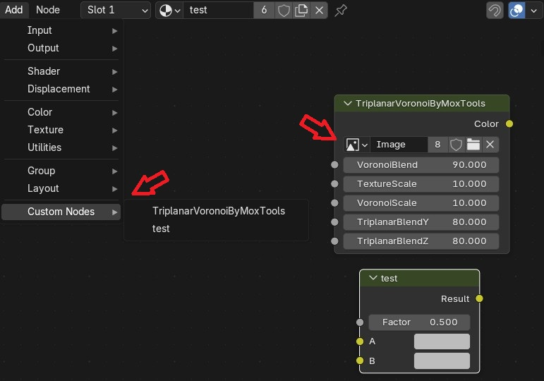

# Tiny Custom Nodes Exporter (by MoxTools)

A lightweight Blender extension/add-on that allows technical artists and developers to export any **Shader Node Group** into a standalone, fully installable Blender add-on (`.py`). 

### The Problem It Solves
In Blender, standard Node Groups cannot natively expose Image Texture blocks as dynamic inputs on the outside of the group container. If you share a material asset, users have to tab inside the group just to change a texture. 

**Tiny Custom Nodes Exporter** solves this by wrapping your group into a custom `ShaderNodeCustomGroup` python class and automatically injecting a native UI `PointerProperty` for your textures directly onto the node container.

---

## 📸 Visual Guide (Screenshots)

### 1. Exporting a Node Group
Simply right-click any Node Group container in the Shader Editor and select **Export as Custom Node...**.

### 2. Setting Up Textures Natively
The generated add-on automatically exposes texture slots directly on the node's custom layout—no tabbing inside required!

---

## 🚀 Features
- **One-Click Export:** Instantly turn any active node tree into an installation-ready Python script.
- **Dynamic Texture Pointers:** Automatically detects internal `TEX_IMAGE` nodes and exposes clean UI fields for quick image assignment.
- **Collision-Free Menu Integration:** Safely registers generated nodes into a shared `Shift+A > Custom Nodes` menu without breaking or overriding other add-ons.
- **Memory Safe:** Automatically flushes generated internal node groups from Blender's data cache once the node instance is deleted (`free()`).

---

## 🛠 Compatibility & Requirements
- **Developed & Tested with:** Blender 5.1.2
- **Architecture:** Built on the modern `node_tree.interface` API (introduced in Blender 4.0).
- **Not Compatible with:** Blender 3.x or older.

> ⚠️ **Disclaimer:** This tool is provided as-is and was exclusively tested on Blender 5.1.2. If you happen to run it on older Blender 4.x versions or other 5.x sub-versions, feel free to drop a comment or discussion note letting the community know if it worked out-of-the-box or not! 

---

## 📦 Installation
1. Download the `tiny_custom_nodes_exporter.py` from the latest [Releases](https://github.com/MoxTools/blender-tiny-custom-nodes-exporter/releases) page.
2. In Blender, go to `Edit > Preferences > Add-ons`.
3. Click **Install...** in the top right corner, select the downloaded `.py` file, and enable the add-on.

---

## 📖 Usage Workflow

1. Open the **Shader Editor** and select or create a **Node Group**.
2. **Right-click** the Node Group container.
3. Select **Export '{Your_Node_Group_Name}' as Custom Node...** from the bottom of the context menu.
4. Choose a target file path. The exporter will automatically default to `customnode_<name>.py`.
5. Install the newly generated `.py` file as a separate, standalone add-on. 
6. You can now find your fully wrapped node under `Shift+A > Custom Nodes` in any shader tree!

---

## 💡 Limitations & Important Notes
* **Global Texture Assignment:** The exporter currently assigns the selected texture pointer to *all* internal image texture nodes found inside the group wrapper. Ensure your nodes are structured accordingly.

---

## 📝 License
Distributed under the MIT License. See `LICENSE` for more information.
